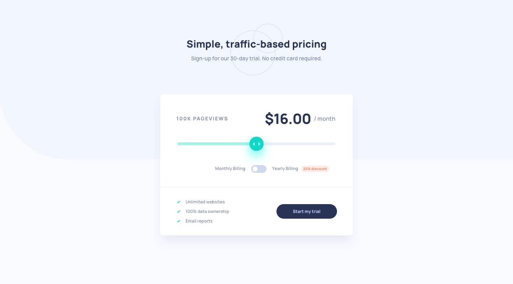

# Interactive Pricing Component

This is a solution to the [Frontend Mentor - Interactive Pricing Component Challenge](https://www.frontendmentor.io/challenges/interactive-pricing-component-t0m8PIyY8).  
Built using **React** and **Tailwind CSS**.

## 📌 Features
- Fully responsive design  
- Dynamic **range slider** for adjusting pageviews and price  
- **Monthly / Yearly billing** toggle with 25% discount applied to yearly plans  
- Smooth gradient progress bar on slider  
- Pricing updates instantly based on slider and toggle values  
- Built with clean, reusable React components and Tailwind utilities

## 🛠️ Built With
- **React** (Functional Components, Hooks)  
- **Tailwind CSS** (Utility-first styling)  
- **Vite** for fast development build  

## 📷 Preview


## 📂 Installation & Setup
```bash
# Clone the repository
git clone https://github.com/yourusername/interactive-pricing-component.git

# Navigate into the project folder
cd interactive-pricing-component

# Install dependencies
bun install

# Run the project locally
bun run dev
